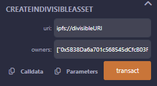
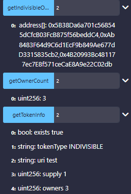
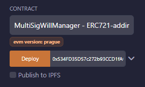
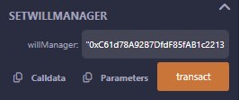
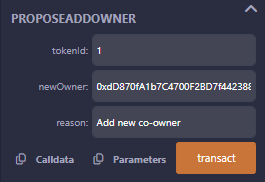
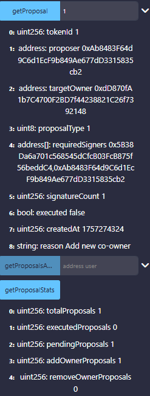
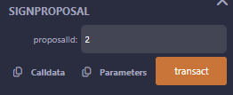
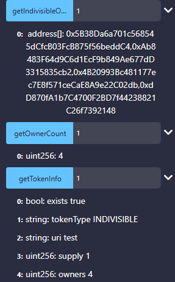

# ERC721 NFT Contract with Owner Management

## Overview

This project demonstrates an ERC721 NFT contract implementation with multi-owner functionality and will management capabilities. The contract allows for indivisible assets with multiple owners and includes a proposal-based system for ownership changes.

## Features

- **Multi-Owner NFT Assets**: Create indivisible assets with multiple owners
- **Will Management Integration**: Built-in will manager functionality
- **Proposal-Based Ownership Changes**: Democratic voting system for ownership modifications
- **Complete Ownership Tracking**: Full transparency of ownership details

## Contract Deployment and Usage

### Step 1: Contract Deployment

User `0x5B3xxxdC4` deploys the ERC721 NFT Contract.

  

### Step 2: Creating Indivisible Assets

The owner creates an indivisible asset by calling the `createIndivisibleAsset` method, specifying the owners:

**Owners:**
- `0x5B3xxxdC4`
- `0xAb8xxxcb2` 
- `0x4B2xxx2db`

### Step 3: Asset Information Retrieval

Asset information can be retrieved using the following methods by passing the token ID:

- `getIndivisibleOwners()` - Returns all owners of the asset
- `getOwnerCount()` - Returns the total number of owners
- `getTokenInfo()` - Returns detailed token information

  

### Step 4: Will Manager Setup

A Will Manager contract is created with address `0xC61xxxF4c` by passing the NFT address as an argument.

To grant access permissions, call the `setWillManager(0xC61xxxF4c)` method, passing the will manager's contract address to enable editing capabilities for the NFT contract.

  

  

### Step 5: Ownership Change Proposals

#### Creating a Proposal

Any current owner can propose a new owner by calling the proposal method with the new proposed owner's address `0xdD8xxx148`. This action returns a unique proposal ID.

  

#### Viewing Proposals

Other owners can log in and view proposal details using the following methods with the proposal ID:

- `getProposal()` - Returns detailed proposal information
- `getProposalStats()` - Returns proposal statistics and voting status

  

### Step 6: Proposal Approval and Execution

#### Approval Process

Each owner can review the proposal details and approve the proposal. The proposal execution depends on the approval status:

- Owners review proposal details
- Each owner votes to approve or reject
- Proposal is executed based on voting results

#### Ownership Update

When all owners approve the proposal, the ownership list is automatically updated:

  

  

## Key Methods

### Asset Management
- `createIndivisibleAsset(address[] owners)` - Create a new multi-owner asset
- `getIndivisibleOwners(uint256 tokenId)` - Get all owners of a token
- `getOwnerCount(uint256 tokenId)` - Get the number of owners
- `getTokenInfo(uint256 tokenId)` - Get detailed token information

### Will Management
- `setWillManager(address willManager)` - Set the will manager contract address

### Proposal System
- `proposeNewOwner(uint256 tokenId, address newOwner)` - Propose a new owner
- `getProposal(uint256 proposalId)` - Get proposal details
- `getProposalStats(uint256 proposalId)` - Get proposal statistics
- `approveProposal(uint256 proposalId)` - Approve a proposal

## Contract Addresses Used in Demo

- **NFT Contract Deployer**: `0x5B3xxxdC4`
- **Initial Owners**: 
  - `0x5B3xxxdC4`
  - `0xAb8xxxcb2`
  - `0x4B2xxx2db`
- **Will Manager Contract**: `0xC61xxxF4c`
- **Proposed New Owner**: `0xdD8xxx148`

## Workflow Summary

1. **Deploy** the ERC721 NFT contract
2. **Create** indivisible assets with multiple owners
3. **Set up** will manager integration
4. **Propose** ownership changes through the voting system
5. **Approve** proposals through multi-signature process
6. **Execute** approved changes automatically

This system ensures democratic control over NFT ownership while maintaining the integrity and security of digital assets through a transparent proposal and voting mechanism.

# ERC 1155 Based Multi-Owner (Individual Property) Will Demonstration
# Part 1
This demonstration showcases a **test version of Multi-Owner Multi-Heir Will** on Remix IDE.  
We present the process step by step with screenshots.

---

## Contract Deployment
The owner with the address `0x5B3xxxdC4` deploys the contract.  
He then creates an asset with three owners:

- `0x5B3xxxxdC4` → 100 coins  
- `0xAb8xxxxcb2` → 200 coins  
- `0x4B2xxx2db` → 300 coins  

  

---

## Multi-Owner Multi-Heir: Individual Will Creation
The asset has been created with **AssetID: 1**, with the holders (owners) as shown below.

  

---

## Setting the WillManager
The creator of **AssetID: 1** sets the `WillManager` with the NFT address `0xC7BxxxB94` and deploys.  
Thus, the `WillManager` gets an address `0xfB7xxx7e4`.  

  

Thereafter, **all the owners approve the WillManager** for managing their cryptowill.

  

---

## Creating the Multi-Owner Multi-Heir Will
Now the `WillManager` creates a Multi-Owner Multi-Heir Will with **individual shares**:

- **TokenID:** 1  
- **Heir Address:** `0xdD8xxx148`  
- **Date of Birth:** (UNIX timestamp)  
- **Condition:** 18 years  
- **Vesting Period:** 0  
- **Token Amount:** 50  
- **Trustees:** `0x787xxxbaB`, `0x617xxx7f2`  
- **Required Trustee Signatures:** 2  

  

---

## Trustee-Based Execution
If the owner fails to respond within the **response time = 60 sec**,  
the transfer depends on the Trustees' signatures.  
Below, the owner does not respond within the due time.

  

  

---

## Seamless Transfer to Heir
After the Trustees sign, the death is approved, and the transfer is seamless.  
The heir’s account gets credited successfully.

  

---

## Summary
This demonstration shows how the **Multi-Owner Multi-Heir Will** works on the testnet with:

- ✅ Multiple owners  
- ✅ Individual will creation  
- ✅ Trustee-based execution  
- ✅ Seamless transfer to heirs  

# Part 2
This demonstration showcases a **test version of Multi-Owner Multi-Heir Will** on Remix IDE.  
We present the process step by step with screenshots.

---

## Contract Deployment
The owner with the address `0x5B3xxxdC4` deploys the contract.  
He then creates an asset with three owners:

- `0x5B3xxxxdC4` → 100 coins  
- `0xAb8xxxxcb2` → 200 coins  
- `0x4B2xxx2db` → 300 coins  

  

---

## Giving Will Manager the Access / Approval
Every owner with the address approves or gives access to the willmanager contract.  

We can check if all have approved or not by giving the owner's address and will managers address

  

  

---

## Whole Property Proposal:
The asset has been created with **tokenID: 1**, with the holder/heir as shown below.

  

---

## checking the Approval Status
 We can verify the holders, how many have approved the whole property and who is remaining

  

  

---

Thereafter, **all the owners approve the whole property using approveWholeProperty() method.

  

---

## Seamless Transfer to Heir
After the Owners sign, the proposal is approved, and the transfer is seamless.  
The heir’s account gets credited successfully.

  

---

